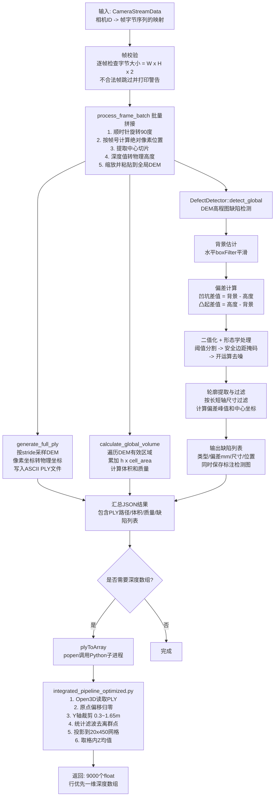
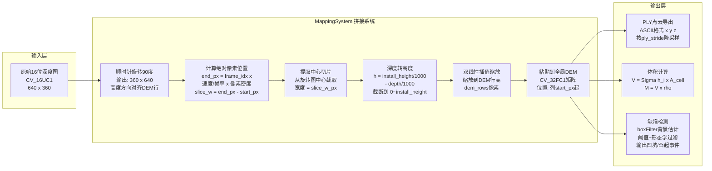

# TobaccoVision

烟草柜深度图像视觉系统：三维点云重建、体积估算与表面缺陷检测。

## 项目概述

本系统用于烟草行业的烟柜装填质量检测。通过安装在烟柜上方的深度相机，连续采集传送带上烟草物料的 16 位深度图序列，经过以下核心处理步骤，输出结构化的检测结果：

1. **线扫描拼接**：将逐帧深度图按传送带运动方向拼接为全局数字高程模型（DEM）
2. **三维点云重建**：从 DEM 导出 PLY 格式的三维点云文件
3. **体积与质量估算**：对 DEM 进行面积积分，结合物料密度计算总体积和总质量
4. **表面缺陷检测**：基于背景差分法识别烟草表面的凹坑（pit）和凸起（bump）异常
5. **深度网格化**（可选）：通过 Python 脚本将 PLY 点云转换为固定尺寸的一维深度数组，供下游模型使用

## 项目结构

```
├── CMakeLists.txt                          # CMake 构建配置
├── config.json                             # 系统运行参数（传感器、拼接、检测、相机内参等）
├── include/
│   ├── common_types.hpp                    # 公共类型定义（CameraStreamData）
│   ├── mapping_system.hpp                  # MappingSystem 类声明：DEM 拼接、PLY 生成、体积计算
│   ├── defect_detector.hpp                 # DefectDetector 类声明：凹坑/凸起缺陷检测
│   └── json.hpp                            # nlohmann/json 头文件库（第三方，header-only）
├── src/
│   ├── mapping_system.cpp                  # MappingSystem 实现：帧旋转、切片拼接、PLY 导出、体积积分
│   └── defect_detector.cpp                 # DefectDetector 实现：背景估计、阈值分割、形态学滤波、轮廓分析
├── api/
│   ├── AnalyzeStream.h                     # analyzeStream() 函数声明
│   ├── analyze_stream.cpp                  # analyzeStream() 实现：编排完整处理流水线
│   ├── ply_array.h                         # plyToArray() 函数声明
│   ├── ply_array.cpp                       # plyToArray() 实现：通过 popen 调用 Python 子进程
│   └── integrated_pipeline_optimized.py    # Python 点云网格化脚本（基于 Open3D + NumPy）
├── test/
│   └── test_analyze_stream.cpp             # 集成测试：单相机、plyToArray
├── dataset/                                # 测试用深度图数据集
│   └── continuous_verify/depth/            # 连续采集的 16 位 PNG 深度图序列
├── output_ply/                             # 生成的 PLY 点云文件输出目录
└── result_images/                          # 缺陷检测可视化结果图（标注了缺陷框的 JPG）
```

## 模块依赖关系

```
common_types.hpp（CameraStreamData 类型）
       │
       ▼
AnalyzeStream.h ───► analyze_stream.cpp（流水线编排）
                          │         │
                          ▼         ▼
                 MappingSystem  DefectDetector
                 （拼接/体积）   （缺陷检测）
                          │         │
                          └────┬────┘
                               ▼
                         json.hpp + OpenCV

ply_array.h ──► ply_array.cpp ──► json.hpp + popen(Python)
```

## 依赖

### C++ 依赖

| 依赖项 | 版本要求 | 用途 | 备注 |
|---|---|---|---|
| CMake | >= 3.10 | 构建系统 | |
| C++17 | GCC 7+ / MSVC 2017+ | 编译标准 | 使用 `<filesystem>` 等特性 |
| OpenCV | >= 4.x | 图像处理、矩阵运算 | 核心依赖 |
| nlohmann/json | 3.x | JSON 解析与序列化 | 已内置于 `include/json.hpp` |

### Python 依赖（仅 `plyToArray()` 使用）

| 依赖项 | 用途 | 安装方式 |
|---|---|---|
| Python 3 | 脚本解释器 | 路径在 config.json 中配置 |
| Open3D | PLY 点云读取、统计滤波 | `pip install open3d` |
| NumPy | 数组运算、网格化 | `pip install numpy` |
| Matplotlib | 可视化（仅调试时使用） | `pip install matplotlib` |

### 可选 GPU 加速

当 OpenCV 编译时启用了 CUDA 模块（`cudaimgproc`、`cudafilters`、`cudaarithm`），MappingSystem 和 DefectDetector 会自动检测并切换到 GPU 加速路径，无需修改任何配置。加速范围包括：

- 深度图到高度图的转换
- DEM 切片缩放
- 背景滤波（boxFilter）
- 阈值分割与形态学运算

## 构建

```bash
# 清理并重新构建
rm -rf build && mkdir build && cd build
cmake .. && make -j$(nproc)
```

构建产物：

| 文件 | 类型 | 说明 |
|---|---|---|
| `libtobacco_api.a` | 静态库 | 包含所有核心功能，供外部项目链接集成 |
| `test_stream` | 可执行文件 | 集成测试程序 |

在外部项目中集成示例：

```cmake
target_link_libraries(your_app PRIVATE tobacco_api)
```

## API 接口

系统对外暴露两个 C++ 函数接口，调用者无需关心内部的 MappingSystem、DefectDetector 等实现细节。

### `analyzeStream()` -- 核心分析接口

```cpp
#include "AnalyzeStream.h"

std::string analyzeStream(const CameraStreamData& streams, int batchId);
```

**功能：** 接收相机的深度帧序列，依次执行拼接、点云生成、体积计算和缺陷检测，返回 JSON 格式的完整结果。

**参数：**

| 参数 | 类型 | 说明 |
|---|---|---|
| `streams` | `CameraStreamData` | 相机 ID 到帧序列的映射。每帧为 `vector<unsigned char>`，存储 16 位深度图的原始字节（行优先，大小 = 宽 x 高 x 2） |
| `batchId` | `int` | 批次号，用于 PLY 文件和检测图的命名 |

**返回值：** JSON 字符串，结构如下：

```json
{
  "batch_id": 90001,
  "camera_count": 1,
  "cameras": [
    {
      "camera_id": 101,
      "total_frames": 200,
      "valid_frames": 200,
      "ply_path": "output_ply/Global_Stitched_90001.ply",
      "volume_m3": 11.28,
      "mass_kg": 1692.68,
      "has_anomaly": true,
      "anomaly_image": "result_images/cam_101_batch_90001_detect.jpg",
      "defects": [
        {
          "type": "pit",
          "dev_mm": -182.88,
          "width_mm": 650.0,
          "length_mm": 290.0,
          "center_x_m": 1.595,
          "center_y_m": -0.095
        }
      ]
    }
  ]
}
```

**返回字段说明：**

| 字段 | 类型 | 说明 |
|---|---|---|
| `batch_id` | int | 批次号 |
| `camera_count` | int | 相机数量 |
| `camera_id` | int | 相机 ID |
| `total_frames` | int | 该相机收到的总帧数 |
| `valid_frames` | int | 通过字节大小校验的有效帧数 |
| `ply_path` | string | 生成的 PLY 点云文件路径 |
| `volume_m3` | float | 烟草体积（立方米） |
| `mass_kg` | float | 估算质量（千克），volume x material_rho |
| `has_anomaly` | bool | 是否检测到缺陷 |
| `anomaly_image` | string | 标注了缺陷框的检测结果图路径 |
| `defects` | array | 缺陷列表 |
| `defects[].type` | string | 缺陷类型：`"pit"`（凹坑）或 `"bump"`（凸起） |
| `defects[].dev_mm` | float | 偏差值（mm），凹坑为负，凸起为正 |
| `defects[].width_mm` | float | 缺陷宽度（mm） |
| `defects[].length_mm` | float | 缺陷长度（mm） |
| `defects[].center_x_m` | float | 缺陷中心 X 坐标（米） |
| `defects[].center_y_m` | float | 缺陷中心 Y 坐标（米） |

**内部处理流程：**
1. 从 `config.json` 读取相机帧尺寸
2. 创建 MappingSystem 和 DefectDetector 实例
3. 校验每帧字节大小（必须 = frame_width x frame_height x 2），跳过不合法帧
4. 调用 `process_frame_batch()` 批量拼接所有有效帧到 DEM
5. 调用 `generate_full_ply()` 从 DEM 导出 PLY 文件
6. 调用 `calculate_global_volume()` 积分计算体积和质量
7. 调用 `detect_global()` 在 DEM 上运行缺陷检测
8. 将检测结果图重命名为带相机 ID 和批次号的文件名
9. 汇总结果为 JSON 返回

**输出目录：** PLY 文件输出到 `output_ply/`

---

### `plyToArray()` -- 点云转深度数组

```cpp
#include "ply_array.h"

std::vector<float> plyToArray(const std::string& plyPath);
```

**功能：** 将 PLY 点云文件转换为固定尺寸的一维深度数组，供下游机器学习模型或数据分析使用。

**参数：**

| 参数 | 类型 | 说明 |
|---|---|---|
| `plyPath` | `string` | PLY 点云文件路径 |

**返回值：** `vector<float>`，大小固定为 9000（20 行 x 450 列），行优先排列的深度网格。

**内部处理流程：**
1. 从 `config.json` 读取 Python 解释器路径和脚本路径
2. 通过 `popen()` 调用 `integrated_pipeline_optimized.py`
3. Python 脚本内部执行：
   - Open3D 读取 PLY 文件
   - 原点偏移归零
   - Y 轴裁剪（默认 0.3 ~ 1.65 米）
   - 统计滤波去除离群点（10 邻居，3 倍标准差）
   - 二次原点偏移
   - 投影到 20 x 450 的均匀网格，取每个格子内 Z 值均值
4. Python 输出 JSON 数组，C++ 侧解析为 `vector<float>` 返回

## 核心模块详解

### MappingSystem -- 线扫描拼接系统

**职责：** 将连续的深度帧按传送带运动方向拼接为全局 DEM（数字高程模型）。

**关键参数：**
- `install_height_mm`：传感器安装高度，用于将深度值转换为物体高度（`h = install_height - depth`）
- `belt_speed_m_s` 和 `fps`：决定每帧对应的物理位移量（`displacement = speed / fps`）
- `px_per_m`：DEM 分辨率，每米对应多少像素
- `dem_rows` x `dem_cols`：DEM 矩阵的固定尺寸（高 x 最大宽）

**单帧处理步骤（`process_frame`）：**
1. 将 640x360 的深度图顺时针旋转 90 度，变为 360x640（高度方向对齐 DEM 行方向）
2. 根据帧编号计算该帧应占的绝对像素列范围 `[start_px, end_px)`
3. 从旋转后图像的中心区域提取宽度为 `slice_w_px` 的切片
4. 将 16 位深度值转换为物理高度（米）：`h = install_height/1000 - depth/1000`
5. 将切片缩放到 DEM 行高，粘贴到全局 DEM 矩阵的对应列位置

**体积计算（`calculate_global_volume`）：**
- 遍历 DEM 有效区域内每个像素
- 对高度超过 `min_object_height_m` 的像素，累加 `h x cell_area`（单元面积 = 1/px_per_m^2）
- 质量 = 体积 x `material_rho`

**PLY 导出（`generate_full_ply`）：**
- 按 `ply_stride` 步长采样 DEM 中有效高度的点
- 将像素坐标转为物理坐标（米），写入 ASCII 格式的 PLY 文件

### DefectDetector -- 缺陷检测器

**职责：** 在 DEM 高程图上检测表面凹坑和凸起缺陷。

**检测算法：**
1. 将 DEM（单位：米）转换为毫米高程图
2. 将超出有效高度范围的像素值替换为安全背景高度
3. 使用水平方向 `boxFilter`（宽度由 `bg_kernel_width` 配置）估计局部背景
4. 计算偏差：凹坑偏差 = 背景 - 高度，凸起偏差 = 高度 - 背景
5. 对偏差图应用阈值（`threshold_mm`），得到二值掩码
6. 应用安全边距掩码（排除图像边缘 `margin_x_px` x `margin_y_px` 区域的干扰）
7. 形态学开运算去除噪声
8. 提取轮廓，按尺寸过滤（长轴 >= `min_long_mm`，短轴 >= `min_short_mm`）
9. 输出满足条件的缺陷事件，同时在可视化图上标注矩形框

**缺陷过滤规则：**
- 必须同时满足深度阈值和尺寸阈值才被报告
- 仅满足深度阈值但不满足尺寸阈值的缺陷会被过滤，并在终端打印 `[Filtered]` 日志

## 配置说明

所有配置集中在项目根目录的 `config.json` 文件中，各模块启动时自动读取。

### system -- 系统全局参数

| 键名 | 类型 | 默认值 | 说明 |
|---|---|---|---|
| `install_height_mm` | float | 2700.0 | 深度相机安装高度（毫米） |
| `belt_speed_m_s` | float | 0.132 | 传送带速度（米/秒） |
| `fps` | float | 5.0 | 深度相机采集帧率 |
| `px_per_m` | int | 100 | DEM 分辨率：每米对应的像素数 |
| `min_valid_height_mm` | float | 0.0 | 有效高度下限（毫米），低于此值视为噪声 |
| `max_valid_height_mm` | float | 2000.0 | 有效高度上限（毫米），高于此值视为无效 |
| `material_rho` | float | 150.0 | 物料密度（kg/m3），用于质量 = 体积 x 密度 |
| `min_object_height_m` | float | 0.02 | 最小有效物体高度（米），低于此高度不计入体积 |

### mapping -- 拼接参数

| 键名 | 类型 | 默认值 | 说明 |
|---|---|---|---|
| `dem_rows` | int | 200 | DEM 矩阵行数（垂直于传送带方向的分辨率） |
| `dem_cols` | int | 6000 | DEM 矩阵最大列数（传送带方向的最大长度） |
| `ply_stride` | int | 2 | PLY 导出时的降采样步长，值越大文件越小 |

### defect -- 缺陷检测参数

| 键名 | 类型 | 默认值 | 说明 |
|---|---|---|---|
| `threshold_mm` | float | 80.0 | 缺陷偏差阈值（毫米），偏差大于此值才标记为缺陷候选 |
| `min_long_mm` | float | 300.0 | 缺陷最小长轴尺寸（毫米） |
| `min_short_mm` | float | 100.0 | 缺陷最小短轴尺寸（毫米） |
| `margin_x_px` | int | 35 | 水平安全边距（像素），边缘区域不检测 |
| `margin_y_px` | int | 45 | 垂直安全边距（像素），边缘区域不检测 |
| `bg_kernel_width` | int | 301 | 背景估计 boxFilter 核宽度（像素），必须为奇数 |
| `morph_kernel_size` | int | 5 | 形态学开运算核大小（像素），必须为奇数 |
| `draw_filtered` | bool | false | 是否在结果图上绘制被过滤掉的缺陷框（调试用） |

### camera -- 相机内参

| 键名 | 类型 | 默认值 | 说明 |
|---|---|---|---|
| `fx` / `fy` | float | 600 | 焦距（像素） |
| `cx` / `cy` | float | 320.0 / 180.0 | 光心坐标（像素） |
| `frame_width` | int | 640 | 输入深度帧宽度 |
| `frame_height` | int | 360 | 输入深度帧高度 |

### python -- Python 环境配置

| 键名 | 类型 | 说明 |
|---|---|---|
| `python_bin` | string | Python 解释器的绝对路径 |
| `script_path` | string | PLY 网格化脚本的相对路径 |

## 处理流程图



## 帧处理细节流程图



## 测试

### 运行测试

```bash
cd /path/to/project
./build/test_stream
```

**前置条件：**
- `dataset/continuous_verify/depth/` 目录下需要有 16 位 PNG 深度图序列
- `config.json` 中的 Python 路径配置正确（`plyToArray` 测试需要）

### 测试内容

测试程序依次执行两项测试：

| 测试项 | 说明 | 预期结果 |
|---|---|---|
| 单相机测试 | camId=101，全部帧 | 输出 JSON 包含 ply_path、volume_m3、defects 字段 |
| plyToArray 测试 | 读取单相机生成的 PLY | 返回 9000 个 float |

### 测试输出示例

```
Found 200 depth images
Loaded 200 valid frames (460800 bytes each)

===== Single Camera Test (camId=101, 200 frames) =====
Result JSON:
{"batch_id":90001,"camera_count":1,"cameras":[{"camera_id":101,...,"volume_m3":11.28,...}]}

===== plyToArray Test =====
Array size: 9000
First 10 values: 0.441062 0.439 0.432063 ...
```
